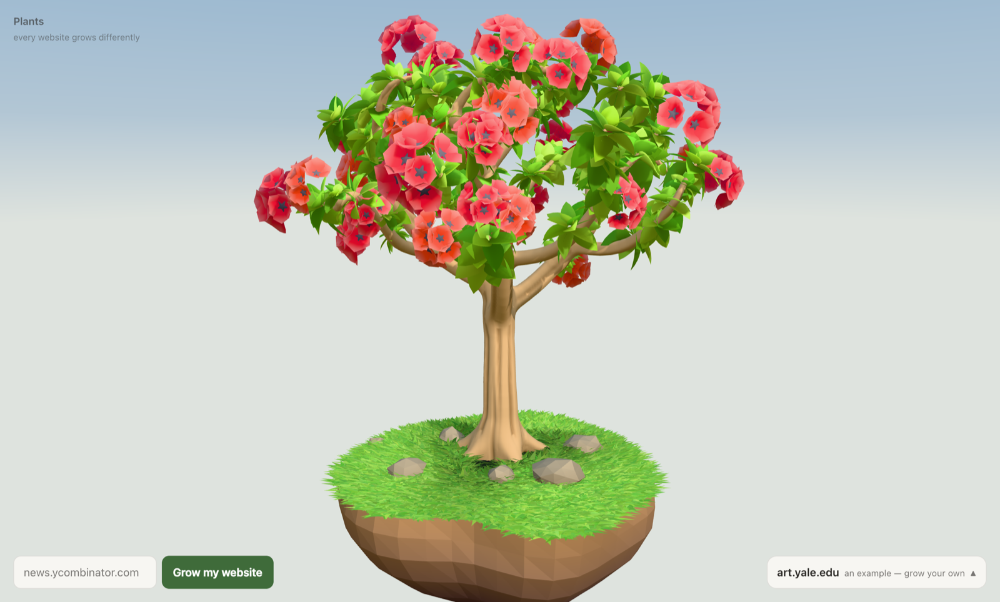
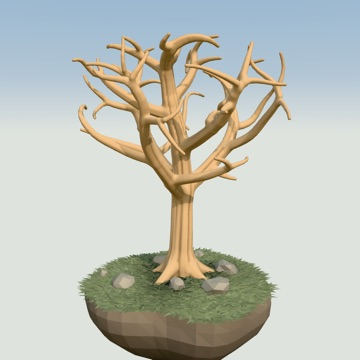
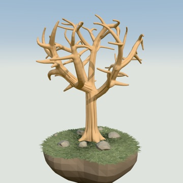
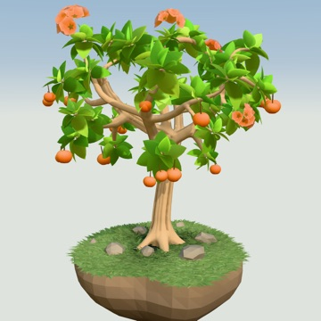
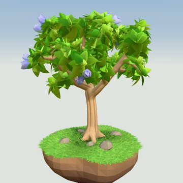
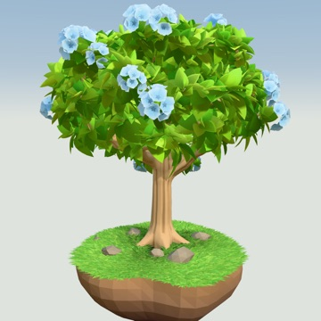
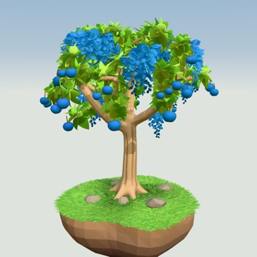
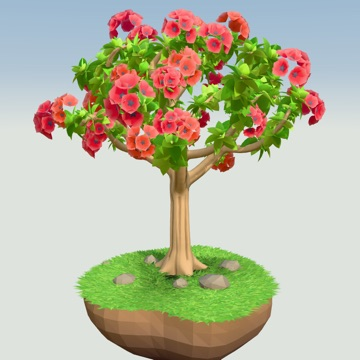
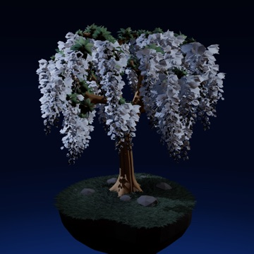
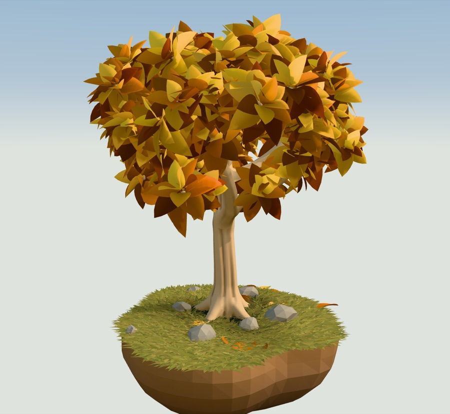

<div align="center">



# 🌳 plants

### Paste a website. Watch a tree grow out of it.

[](https://plants-three-eta.vercel.app)

[](https://github.com/Antara-Paul04/plants/stargazers)
[](https://github.com/Antara-Paul04/plants/commits)
[](https://threejs.org)
[](https://playwright.dev)

**[🌐 Try it](https://plants-three-eta.vercel.app)** · [⚡ Run it locally](#-quick-start) · [🧬 How it works](#-how-a-website-becomes-a-tree) · [📚 Docs](#-docs)

</div>

---

## 🌱 What it is

A tree grown from how a website **looks** — not what it's about. 📷 A photography
blog does not grow cameras.

A real browser goes and looks at the site. How much styling it carries, how
densely it fills the frame, whether it has a colour of its own and whether that
colour is scattered or pooled. Those measurements become **Botanical DNA**, and
the DNA grows the tree.

🔒 Same address, same tree, every time. No database, no accounts, nothing stored —
the seed is the domain name.

---

## 🖼️ Every website grows differently

<table>
<tr>
<td align="center" width="25%"><br><b>info.cern.ch</b><br><sub>🦴 bare · unstyled HTML</sub></td>
<td align="center" width="25%"><br><b>danluu.com</b><br><sub>🦴 bare · text only</sub></td>
<td align="center" width="25%"><br><b>news.ycombinator.com</b><br><sub>🍊 sparse · one orange accent</sub></td>
<td align="center" width="25%"><br><b>arxiv.org</b><br><sub>🌿 full foliage · a few flowers</sub></td>
</tr>
<tr>
<td align="center"><br><b>threejs.org</b><br><sub>🌲 dense canopy</sub></td>
<td align="center"><br><b>gov.uk</b><br><sub>🫐 flowering + fruit</sub></td>
<td align="center"><br><b>art.yale.edu</b><br><sub>🌺 flowering</sub></td>
<td align="center"><br><b>linear.app</b><br><sub>🌙 night · abundant bloom</sub></td>
</tr>
</table>

### 🍁 Seasons happen

<table>
<tr>
<td width="55%">

A site whose colour is mostly **warm** grows an **autumn** tree 🍂 — gold and
rust, with leaves that let go when the wind gusts.

A **deliberately colourless** site grows a **winter** tree ❄️.

An **unstyled** one grows no leaves at all 🦴.

Nobody picks these. They fall out of the measurements.

</td>
<td width="45%" align="center">
<br>
<sub><b>smashingmagazine.com</b> 🍁</sub>
</td>
</tr>
</table>

---

## ⚡ Quick start

```bash
node app/server.js
```

Open **http://localhost:5170** and paste something in.

> 💡 Start with `info.cern.ch` — the first website ever published, unstyled HTML,
> grows a bare sculptural tree. Then try `stripe.com` and watch what a designed
> page does. That pair is the whole idea in about forty seconds.

Needs Node and a Chrome on the machine (`PLANTS_CHROME` overrides the path).
The browser is reused between reads, so the first site is slow and the rest are not.

---

## 🧬 How a website becomes a tree

```
🌐 website
   ↓  a real browser goes and looks at it
📊 measurements      ink · styling richness · palette · colour concentration · motion
   ↓
🧬 Botanical DNA     foliage · density · season · flowers · fruit · terrain · sky
   ↓
🌳 a stylised 3D tree
```

---

## 📚 Docs

| | |
| --- | --- |
| 🤖 [AGENTS.md](AGENTS.md) | Operating manual — agents read this first |
| 🎯 [PRODUCT.md](docs/PRODUCT.md) | What this is, and what it deliberately is not |
| ⚖️ [DECISIONS.md](docs/DECISIONS.md) | Settled decisions, with the reasoning attached |
| 📍 [STATUS.md](docs/STATUS.md) | Present state and known defects |
| 🎨 [VISUAL-SYSTEM.md](docs/VISUAL-SYSTEM.md) | Art direction |
| 🌲 [TREE-SYSTEM.md](docs/TREE-SYSTEM.md) | How a tree is actually built |
| 🔍 [WEBSITE-ANALYSIS.md](docs/WEBSITE-ANALYSIS.md) | How a website is actually read |
| 🚀 [DEPLOYMENT.md](docs/DEPLOYMENT.md) | The gate deployment had to pass |
| 💡 [FINDINGS.md](docs/FINDINGS.md) | Surprising things we measured along the way |
| 🧪 [references/experiments/](references/experiments/) | Things that didn't work, with the numbers that killed them |

---

## 🚧 State of things

Works end to end and it's deployed. It's also rough in specific, documented ways —
one hand-authored tree family rather than a general generator, no forest, no
accounts, and 41 of 56 surveyed sites land in the middle two of four states.

[STATUS.md](docs/STATUS.md) is the honest list, including defects you could meet today.

<div align="center">
<br>
<sub>🌳 built as a small creative internet experiment</sub>
</div>
